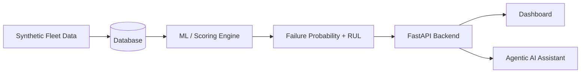

# FleetGuard AI

> Predictive Failure Engine and Agentic AI Assistant for Commercial Vehicle Fleets

FleetGuard AI is a predictive maintenance platform for commercial fleets. It combines synthetic telematics and failure history, applies correlative risk analysis, and exposes actionable vehicle health signals through a backend API and AI assistant.

## Overview

Modern fleet operations generate large volumes of telematics signals, but they rarely surface the leading indicators of component failure early enough to act. FleetGuard AI addresses that gap by modeling historical failure patterns and live vehicle behavior to estimate:

- failure probability for critical parts
- risk tiers and precursor signals
- remaining useful life (RUL)
- fleet-wide risk trends
- natural-language insights grounded in the backend data

The platform is designed to support operational teams and decision makers with clear, data-backed outputs rather than opaque model scores alone.

## What the project is building

FleetGuard AI helps teams:

- generate synthetic fleet data for testing and modeling
- analyze component-level failure correlations
- score vehicles and parts using telemetry patterns
- classify risk levels and prioritize intervention
- estimate remaining useful life for high-risk components
- expose results through a dashboard and AI-driven assistant

## Architecture



## Core components

### Backend
The backend is the control plane for the platform. It handles data generation, persistence, prediction logic, RUL calculations, and the API layer that powers the rest of the application.

### ML and scoring engine
The scoring engine evaluates component-specific rules based on live telematics data and historical failure signatures. It outputs failure probability, risk classification, and a ranked list of precursor signals.

### Agentic AI
The AI layer is grounded to backend tools and returns responses only from validated fleet data. This keeps answers interpretable and prevents speculative or fabricated fleet insights.

## Technology stack

| Layer | Technology | Status |
| --- | --- | --- |
| Backend | Python, FastAPI | Active |
| Database | SQLAlchemy, SQLite | Active |
| ML | pandas, scikit-learn | Active |
| AI | Google Gemini via GenAI SDK | Active |
| Frontend | React + Tailwind CSS | Planned |

## Repository structure

```text
Fleet AI backend/
├── fleetguard-backend/
│   ├── app/
│   │   ├── api/
│   │   ├── ml/
│   │   ├── database.py
│   │   ├── main.py
│   │   ├── models.py
│   │   └── schemas.py
│   ├── generate_data.py
│   ├── clean_db.py
│   ├── requirements.txt
│   ├── test_agent.py
│   └── README.md
├── README.md
└── .gitignore
```

## Feature set

- Synthetic fleet data generation
- Failure correlation and rule evaluation
- Part-specific risk scoring
- Probability-based failure classification
- Remaining useful life estimation
- Fleet-level summary and drilldown analysis
- Grounded natural-language assistant for fleet questions
- Dashboard-ready API responses

## Current project status

This project is in active development. The backend already includes:

- synthetic fleet and failure generation
- SQLAlchemy models for vehicles, parts, telematics, rules, and predictions
- ML scoring and risk logic
- FastAPI endpoints for fleet summary, predictions, and AI tools
- a Gemini-backed chat assistant with grounded tool usage

Planned next steps include:

- frontend dashboard polish
- richer rule management and UX flows
- expanded analytics and comparison views
- production-grade deployment configuration

## Getting started

### Prerequisites

- Python 3.10+
- pip
- virtual environment support

### 1. Clone the repository

```bash
git clone <repository-url>
cd "Fleet AI backend"
```

### 2. Set up the backend environment

```bash
cd fleetguard-backend
python -m venv .venv
source .venv/bin/activate
pip install -r requirements.txt
```

### 3. Configure environment variables

Create a `.env` file in `fleetguard-backend/`:

```env
GEMINI_API_KEY=your_google_gemini_api_key
```

### 4. Generate the synthetic fleet dataset

```bash
python generate_data.py
```

### 5. Start the API

```bash
uvicorn app.main:app --reload
```

The app will be available at:

- http://127.0.0.1:8000
- health check: http://127.0.0.1:8000/api/health

## API and project flow

The backend exposes endpoints for:

- fleet summaries and risk trends
- vehicle and part analysis
- prediction outputs
- top precursor signals
- AI tool access and chat requests

The general flow is:

```text
Synthetic data -> database -> ML scoring -> prediction outputs -> FastAPI -> dashboard / assistant
```

## Roadmap

### Near term
- harden the scoring model behavior and thresholds
- expose more fleet insights through the API
- refine AI tool grounding and response quality

### Medium term
- add frontend dashboard interactions
- add rule builder and scenario tuning
- improve visualization of risk and RUL trends

### Longer term
- production-ready deployment pipeline
- richer fleet analytics and alerting
- operational workflow automation and action recommendations

## Project roles

This project is best understood as a collaboration between:

- Data / ML engineer: synthetic data, feature analysis, probability scoring, failure logic
- Product / operations engineer: dashboard experience, risk decisioning, AI workflow UX

## License

This project is currently under active development and has not yet been assigned a formal public license.

## Notes

FleetGuard AI is intentionally built to surface realistic maintenance insight from synthetic operational data while keeping the system grounded in backend-generated facts. The AI assistant is designed to answer queries using the platform’s actual fleet data instead of free-form speculation.
